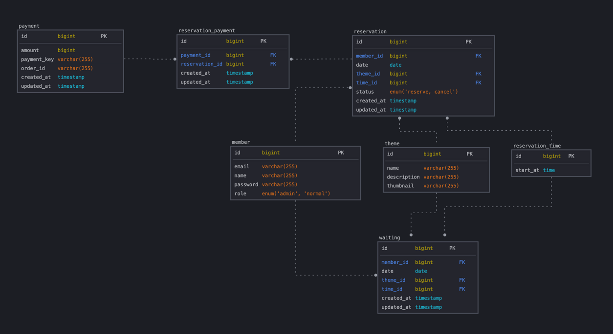

# ERD



[SqlDBM](https://sqldbm.com/Home/)의 아래의 스키마로 Reverse Engineering 기능을 사용하면 ERD를 쉽게 구성할 수 있습니다.
(팀에 합류되는 경우 같은 프로젝트를 Share하여 관리합니다.)

## SCHEMA

팀으로 작업할 경우 같은 

```sql
-- 회원 테이블
CREATE TABLE member (
    id BIGINT PRIMARY KEY,
    email VARCHAR(255),
    name VARCHAR(255),
    password VARCHAR(255),
    role ENUM('ADMIN', 'NORMAL') DEFAULT 'NORMAL'
);

-- 테마 테이블
CREATE TABLE theme (
    id BIGINT PRIMARY KEY,
    name VARCHAR(255),
    description VARCHAR(255),
    thumbnail VARCHAR(255)
);

-- 예약 시간 테이블
CREATE TABLE reservation_time (
    id BIGINT PRIMARY KEY,
    start_at TIME
);

-- 예약 테이블
CREATE TABLE reservation (
    id BIGINT PRIMARY KEY,
    member_id BIGINT NOT NULL,
    date DATE,
    theme_id BIGINT NOT NULL,
    time_id BIGINT NOT NULL,
    status ENUM('RESERVE') DEFAULT 'RESERVE',
    created_at TIMESTAMP DEFAULT CURRENT_TIMESTAMP,
    updated_at TIMESTAMP DEFAULT CURRENT_TIMESTAMP ON UPDATE CURRENT_TIMESTAMP,
    FOREIGN KEY (member_id) REFERENCES member(id),
    FOREIGN KEY (theme_id) REFERENCES theme(id),
    FOREIGN KEY (time_id) REFERENCES reservation_time(id)
);

-- 대기 테이블
CREATE TABLE waiting (
    id BIGINT PRIMARY KEY,
    member_id BIGINT NOT NULL,
    date DATE,
    theme_id BIGINT NOT NULL,
    time_id BIGINT NOT NULL,
    created_at TIMESTAMP DEFAULT CURRENT_TIMESTAMP,
    updated_at TIMESTAMP DEFAULT CURRENT_TIMESTAMP ON UPDATE CURRENT_TIMESTAMP,
    FOREIGN KEY (member_id) REFERENCES member(id),
    FOREIGN KEY (theme_id) REFERENCES theme(id),
    FOREIGN KEY (time_id) REFERENCES reservation_time(id)
);

-- 결제 테이블
CREATE TABLE payment (
    id BIGINT PRIMARY KEY,
    amount BIGINT,
    payment_key VARCHAR(255),
    order_id VARCHAR(255),
    created_at TIMESTAMP DEFAULT CURRENT_TIMESTAMP,
    updated_at TIMESTAMP DEFAULT CURRENT_TIMESTAMP ON UPDATE CURRENT_TIMESTAMP
);

-- 예약 결제 연결 테이블
CREATE TABLE reservation_payment (
    id BIGINT PRIMARY KEY,
    payment_id BIGINT NOT NULL,
    reservation_id BIGINT NOT NULL,
    created_at TIMESTAMP DEFAULT CURRENT_TIMESTAMP,
    updated_at TIMESTAMP DEFAULT CURRENT_TIMESTAMP ON UPDATE CURRENT_TIMESTAMP,
    FOREIGN KEY (payment_id) REFERENCES payment(id),
    FOREIGN KEY (reservation_id) REFERENCES reservation(id)
);
```
