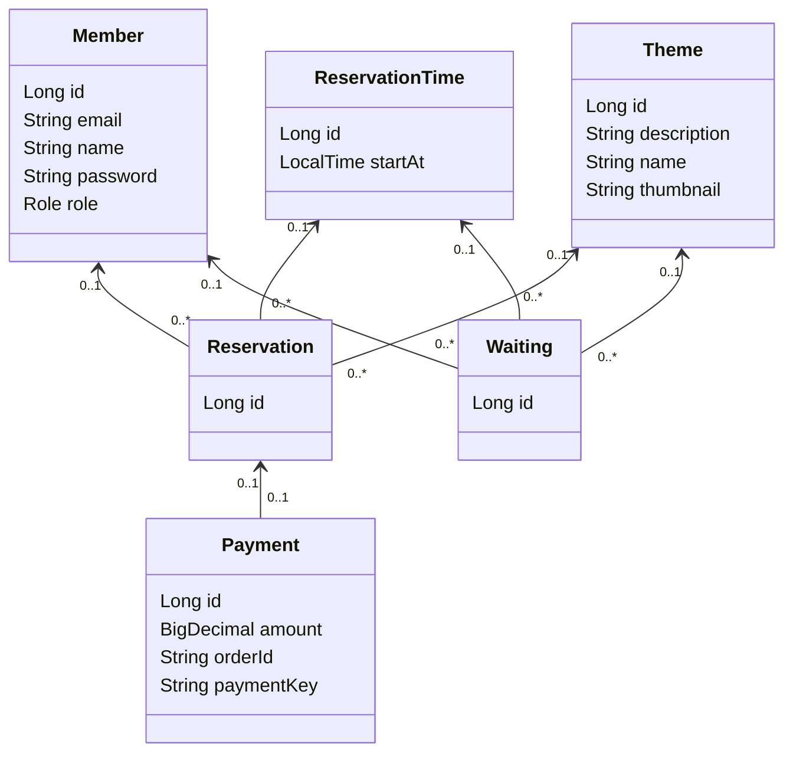

# 방탈출 예약 애플리케이션

## 배포 주소 및 API 명세서

⭐️ [배포 주소](http://3.35.231.231:8080/)  
⭐️ [방탈출 API 명세서](https://alstn113.github.io/spring-roomescape-payment/src/main/resources/static/docs/index.html)

## ERD

