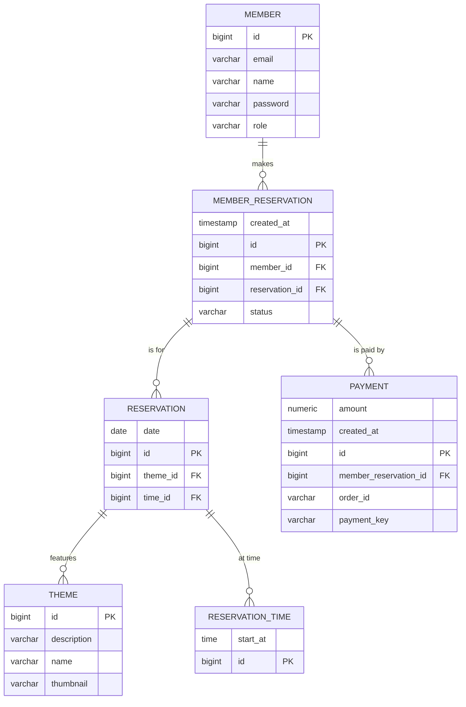

# 🏃 방탈출 예약 시스템

우아한 방탈출 카페의 예약 시스템 웹 애플리케이션 입니다.

## 💁 손님

손님은 회원가입 후 원하는 테마, 날짜, 시간 을 선택하여 방탈출을 예약할 수 있습니다.

### 예약

예약을 할 때는 토스페이먼츠 결제 시스템의 간편결제 방식을 통해 결제를 해야 예약이 정상적으로 처리 됩니다.

> #### ❗ 실제와 동일한 결제 방식이 사용되지만 실제로 결제가 되지는 않습니다.

### 예약 대기

만약 이미 예약이 되어 있을 경우 예약 대기를 할 수 있으며 다른 예약자가 예약을 취소할 경우 가장 우선순위가 높은 예약 대기자가 예약할 할 수 있는 결제 대기 상태가 됩니다.

### 결제 대기

내 예약 목록에 결제 대기인 상태에서 결제 버튼을 눌러 결제를 하게 되면 완전한 예약 상태로 변하게 됩니다.

### 예약 취소

아직 시작 되지 않는 방탈출 예약에 대해서는 1초 전까지 에약 취소가 가능하며 별도의 위약금이나 수수료는 발생하지 않습니다.

## 👷🏻 관리자

관리자는 원하는 손님 정보로 예약을 추가할 수 있으며 모든 예약 정보를 관리할 수 있습니다.

관리자는 테마, 시간을 추가할 수 있고, 아무런 예약이 되어 있지 않은 테마나 시간을 삭제할 수도 있습니다.

## 🧪 Test Account

| 권한  | 이메일                | 비밀번호       |
|-----|--------------------|------------|
| 유저  | `clover@gmail.com` | `password` |
| 어드민 | `admin@gmail.com`  | `password` |

## 📑 API Docs

https://escape.womosoft.com/swagger-ui/index.html

## 🔀 ERD



## 🔧 Setting files

### /etc/systemd/system/roomescape.service

- `sudo systemctl stop roomescape`
- `sudo systemctl start roomescape`

```ini
[Unit]
Description=Roomescape
After=network.target

[Service]
User=ubuntu
Group=nogroup
ExecStart=/usr/bin/java -jar /home/ubuntu/spring-roomescape-payment/run.jar
Restart=always

[Install]
WantedBy=multi-user.target
```

### /etc/nginx/sites-available/escape

- `sudo systemctl stop nginx`
- `sudo systemctl start nginx`

```
server {
        listen 80;
        server_name escape.womosoft.com;
        return 301 https://$server_name$request_uri;
}

server {
        listen 443;
        server_name escape.womosoft.com;

        ssl_certificate /etc/letsencrypt/live/womosoft.com/fullchain.pem;
        ssl_certificate_key /etc/letsencrypt/live/womosoft.com/privkey.pem;
        ssl_trusted_certificate /etc/letsencrypt/live/womosoft.com/chain.pem;
        ssl_dhparam /etc/letsencrypt/ssl-dhparams.pem;
        ssl_session_timeout 10m;
        ssl_session_cache shared:SSL:10m;
        ssl_session_tickets off;

        ssl_protocols TLSv1.2 TLSv1.3;
        ssl_prefer_server_ciphers on;
        ssl_ciphers TLS_AES_256_GCM_SHA384:TLS_CHACHA20_POLY1305_SHA256:TLS_AES_128_GCM_SHA256:ECDHE-RSA-AES256-GCM-SHA384:DHE-RSA-AES256-GCM-SHA384:ECDHE-RSA-AES128-GCM-SHA256;
        ssl_ecdh_curve secp384r1;

        add_header Strict-Transport-Security max-age=31536000;
        add_header X-Content-Type-Options "nosniff" always;
        add_header X-Frame-Options "SAMEORIGIN" always;
        add_header X-XSS-Protection "1; mode=block" always;

        ssl_stapling on;
        ssl_stapling_verify on;

        location / {
                proxy_pass http://127.0.0.1:8080;
        }
}
```
