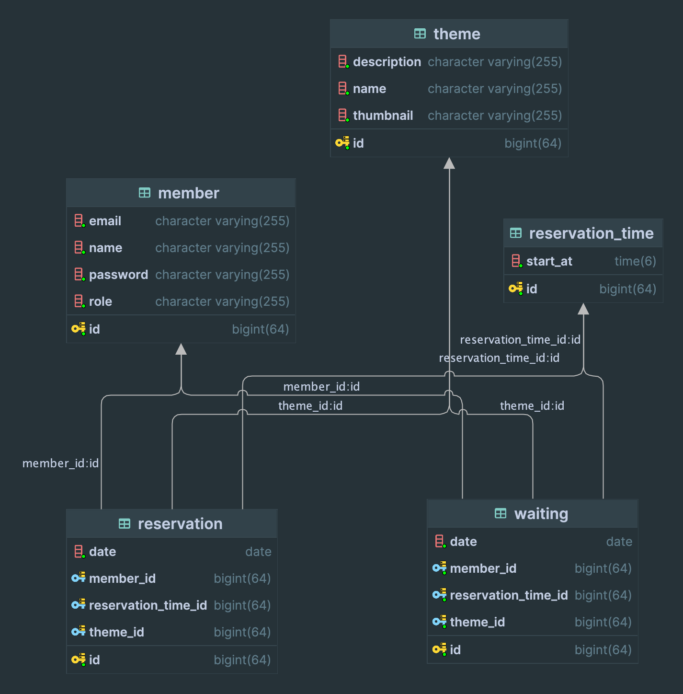

## ERD

## 1 단계
- [x] JPA를 활용하여 데이터베이스에 접근하도록 수정한다.

- [x] `gradle spring-boot-starter-data-jpa`  의존성 추가
- [x] 엔티티 매핑
    - [x] 다른 클래스를 의존하지 않는 클래스 먼저 엔티티 설정을 한다.

- [x] 연관관계 매핑
    - [x] 다른 클래스에 의존하는 클래스는 연관관계 매핑을 추가로 한다.

## 2단계

- [x] 내 예약 목록을 조회하는 API를 구현한다.

## API 명세서

- 내 예약 목록 조회

### Request

> GET member/reservations HTTP/1.1 <br>
> cookie:token=eyJhbGciOiJIUzI1NiJ9.eyJzdWIiOiIxIiwibmFtZSI6IuyWtOuTnOuvvCIsInJvbGUiOiJBR
> E1JTiJ9.vcK93ONRQYPFCxT5KleSM6b7cl1FE-neSLKaFyslsZM <br>
> host: localhost:8080

### Response

> HTTP/1.1 200 <br>
> Content-Type: application/json

```json
[
  {
    "reservationId": 1,
    "theme": "테마1",
    "date": "2024-03-01",
    "time": "10:00",
    "status": "예약"
  },
  {
    "reservationId": 2,
    "theme": "테마2",
    "date": "2024-03-01",
    "time": "12:00",
    "status": "예약"
  },
  {
    "reservationId": 3,
    "theme": "테마3",
    "date": "2024-03-01",
    "time": "14:00",
    "status": "예약"
  }
]
```

## 3단계
- 예약 페이지
  - [x] 예약 대기 요청 기능을 구현한다.
  - [x] 중복 예약이 불가능 하도록 구현한다.
- 내 예약
  - [x] 예약 대기 취소 기능도 함께 구현한다.
  - [x] 내 예약 목록 조회 시 예약 대기 목록도 함께 포함한다.
- [x] 3단계 클라이언트 코드 커밋 을 참고하여 기존 파일을 수정한다.
- [x] `TODO: [3단계]` 주석을 찾아 수정한다.
- 예외 처리
  - [x] 한 사람이 같은 예약 or 예약 대기를 여러번 할 수 없다. 예) 같은 방탈출 예약 후 예약 대기, 예약 대기 2번 이상

## 방탈출 카페 정책

- [x] 방탈출 카페가 시작되는 시간은 8시 이고, 끝나는 시간은 10시이다.

## 4단계
- 어드민 - 예약 대기 관리 기능
  - [x] 어드민은 예약 대기 목록을 조회할 수 있다.
  - [x] 어드민은 예약 대기를 거절할 수 있다.
  - [x] 어드민은 예약 대기를 승인할 수 있다.
- 사용자가 예약 취소시 예약 대기 승인
  - 예약 취소시 예약 대기자가 있는 경우 예약 승인이 된다.
  - 수동 승인의 경우 예약 대기 관리 페이지에서 승인 버튼을 만들어 직접 승인하게 할 수 있다.
  - 자동 승인의 경우 예약 대기가 있을 때 우선순위에 따라 자동으로 예약이 되도록 할 수 있다.
  - 예외 처리
    - [x] 이전 예약이 취소되지 않았는데 승인을 누르면 예외가 발생한다.
    - [x] 첫번째 예약 대기가 아닌데 승인을 누를 경우 예외가 발생한다.

### 예약 대기 및 예약 정책

- [ ] 방탈출 하루 전에는 예약을 취소할 수 없다.
