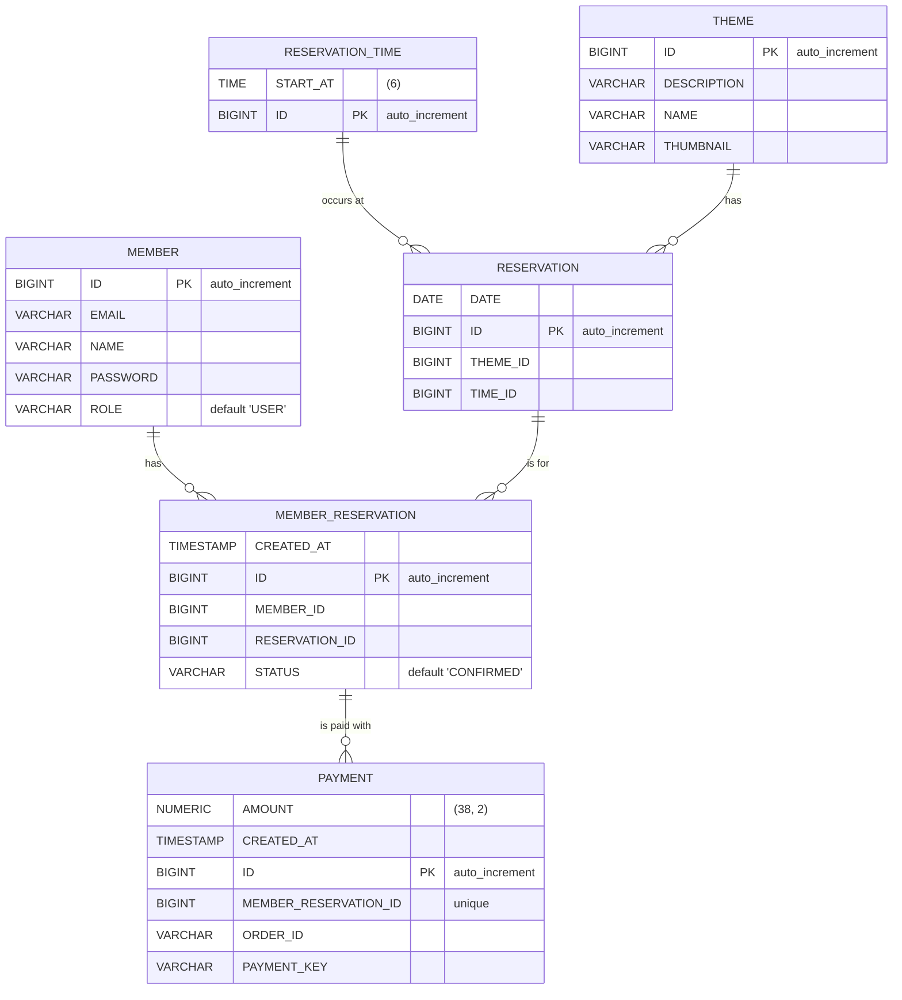

# 방탈출 예약 시스템

우아한 방탈출 카페의 예약 시스템 웹 애플리케이션 입니다.

## 손님

손님은 회원가입 후 원하는 테마, 날짜, 시간 을 선택하여 방탈출을 예약할 수 있습니다.

### 예약

예약을 할 때는 토스페이먼츠 결제 시스템의 간편결제 방식을 통해 결제를 해야 예약이 정상적으로 처리 됩니다.

> #### ❗ 실제와 동일한 결제 방식이 사용되지만 실제로 결제가 되지는 않습니다.

### 예약 대기

만약 이미 예약이 되어 있을 경우 예약 대기를 할 수 있으며 다른 예약자가 예약을 취소할 경우 가장 우선순위가 높은 예약 대기자가 예약할 할 수 있는 결제 대기 상태가 됩니다.

### 결제 대기

내 예약 목록에 결제 대기인 상태에서 결제 버튼을 눌러 결제를 하게 되면 완전한 예약 상태로 변하게 됩니다.

### 예약 취소

아직 시작 되지 않는 방탈출 예약에 대해서는 1초 전까지 에약 취소가 가능하며 별도의 위약금이나 수수료는 발생하지 않습니다.

## 관리자

관리자는 원하는 손님 정보로 예약을 추가할 수 있으며 모든 예약 정보를 관리할 수 있습니다.

관리자는 테마, 시간을 추가할 수 있고, 아무런 예약이 되어 있지 않은 테마나 시간을 삭제할 수도 있습니다.

## API Docs

https://womosoft.com/swagger-ui/index.html

## ERD Diagram

