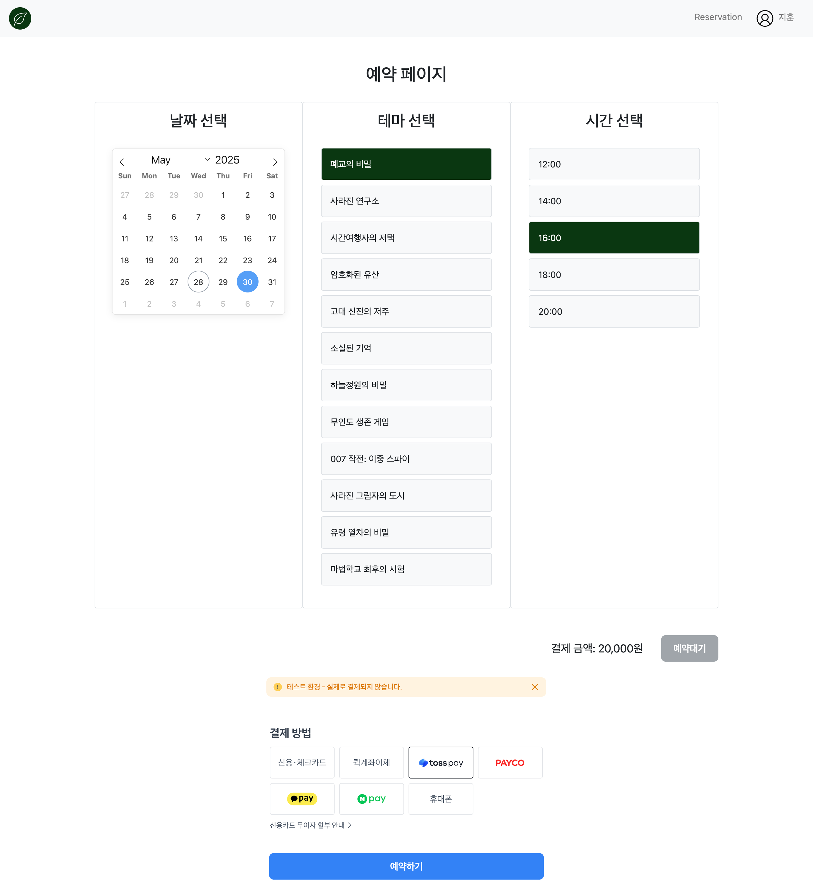
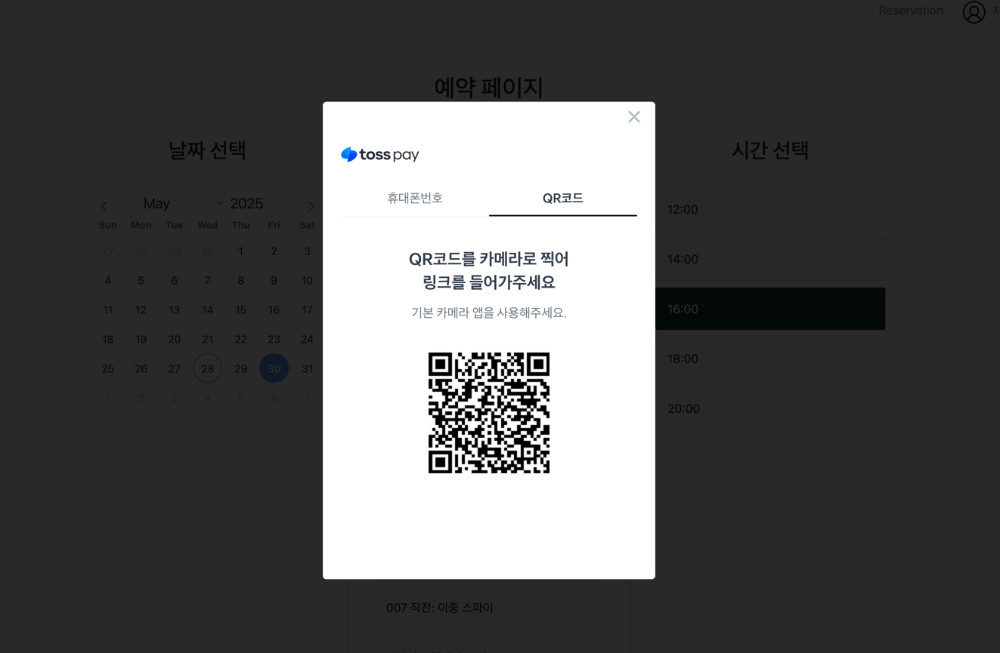
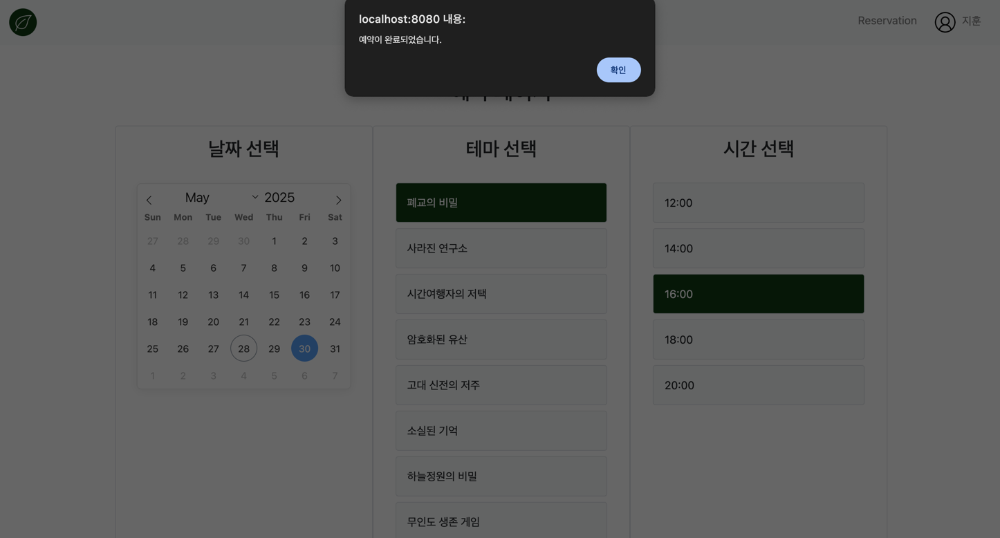
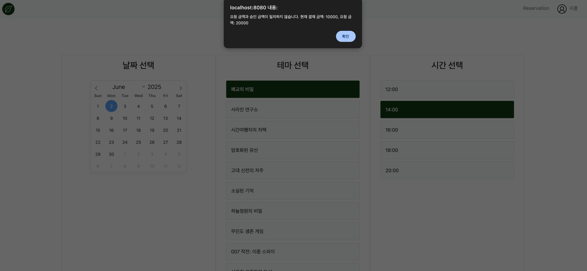
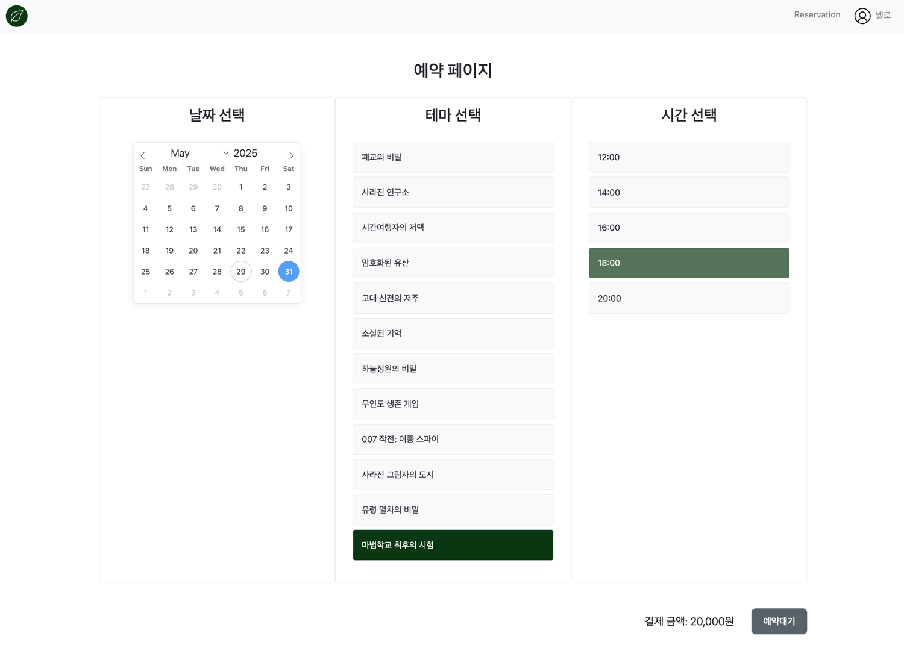
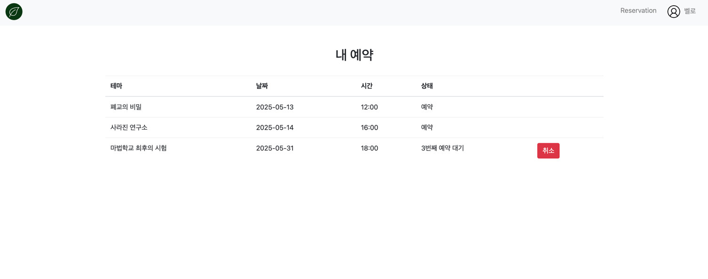
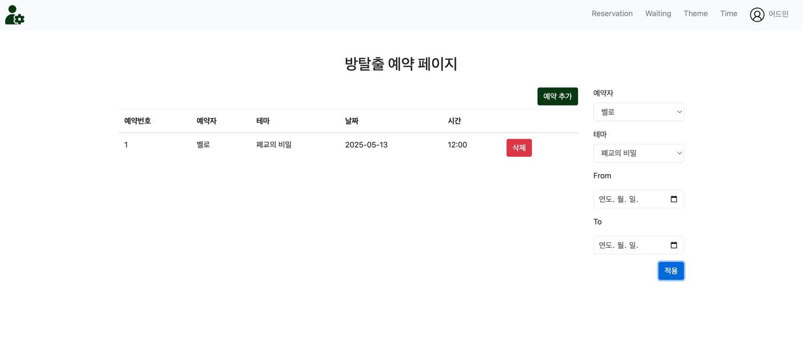
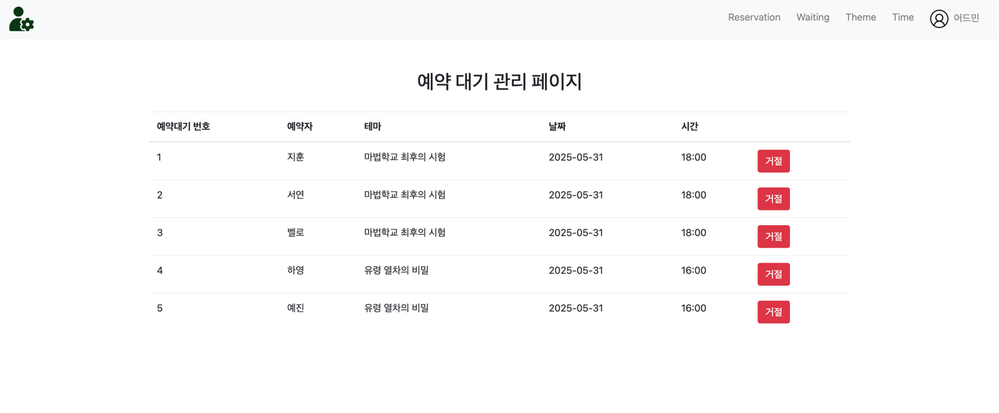

# 방탈출 예약 대기

## 개요

방탈출 예약 내역을 관리하고, 사용자가 방탈출을 예약할 수 있도록 돕는 웹 애플리케이션입니다.

## 제공 기능

방탈출과 예약을 관리하는 `관리자`와 방탈출을 예약하는 `사용자`의 기능을 제공합니다.

[Quick Start](#quick-start) 섹션으로 이동하여 애플리케이션을 실행하고 기능을 체험할 수 있습니다.

### 기능 목록

- 사용자 기능
    - 인기 테마 랭킹
    - 방탈출 예약
        - 결제 후 예약 가능
    - 대기 신청
    - 대기 취소
    - 예약 내역 조회
- 관리자 기능
    - 시간 관리
        - 시간 추가
        - 시간 삭제
    - 테마 관리
        - 테마 추가
        - 테마 삭제
    - 예약 관리
        - 조건으로 예약 조회
        - 예약 추가
        - 예약 삭제
    - 대기 관리
        - 예약 취소 시 대기 자동 승인
        - 대기 취소

# 화면 및 기능 설명

## 예약 과정 (사용자)







- 사용자는 방탈출 예약을 위해 날짜, 테마를 선택하고 예약 시간을 선택합니다.
- 예약 시간은 관리자가 등록한 시간 중에서 선택할 수 있습니다.
- 예약 시간은 현재 시간보다 미래의 시간만 선택할 수 있습니다.
- 예약 시간은 중복 예약이 불가능합니다.

### 결제 전 결제 금액 검증 (사용자)



- 결제 승인 전 결제
  금액을 [검증](https://docs.tosspayments.com/guides/learn/payment-flow#%EA%B2%B0%EC%A0%9C-%EC%A0%95%EB%B3%B4-%EA%B2%80%EC%A6%9D%ED%95%98%EA%B8%B0)
  하여, 잘못된 금액으로 결제가 이루어지지 않도록 합니다.
    - 요청과 승인 사이에 악의적으로 결제 금액을 수정할 수 있기 때문에 orderId(주문번호)와 amount(최종 결제 금액)을 클라이언트에서 서버로 보내 임시로 저장합니다.

## 예약 대기 (사용자)



- 이미 예약된 방탈출에 대해 예약 대기를 요청할 수 있습니다.
- 예약 대기 요청 시 대기 순번이 부여됩니다.
- 예약 대기 요청은 과거 일시로는 요청할 수 없습니다.

## 내 예약 목록 (사용자)



- 내 예약 목록에서 예약과 함께 예약 대기를 요청한 내역(순번 포함)을 확인할 수 있습니다.

## 예약 관리 및 검색 (관리자)



- 관리자는 예약을 조건으로 조회할 수 있습니다.
- 예약을 추가할 수 있습니다.
- 예약을 삭제할 수 있습니다.

## 예약 대기 관리 (관리자)



- 관리자는 예약 대기 목록을 확인할 수 있습니다.
- 예약이 취소되었을 때, 예약 대기가 있는 경우 `자동`으로 첫 번째 예약 대기가 승인됩니다.
- 예약 대기 목록에서 예약 대기를 거절(취소)할 수 있습니다.
- 예약 대기를 취소하면 예약 대기 목록에서 삭제됩니다.

# Quick Start

애플리케이션 실행 후 아래의 링크로 접속할 수 있습니다.

- 관리자 페이지: [localhost:8080/admin](http://localhost:8080/admin)
- 사용자 페이지: [localhost:8080/](http://localhost:8080/)

## 더미 계정

관리자와 사용자의 더미 계정은 아래와 같습니다. 회원가입 후 로그인도 가능합니다.

```text
관리자 계정: admin@email.com
비밀번호: password
사용자 계정: normal@email.com
비밀번호: password
사용자 계정: jihun@email.com
비밀번호: password
-- 더 많은 계정은 data.sql 파일을 참고하세요.
```
