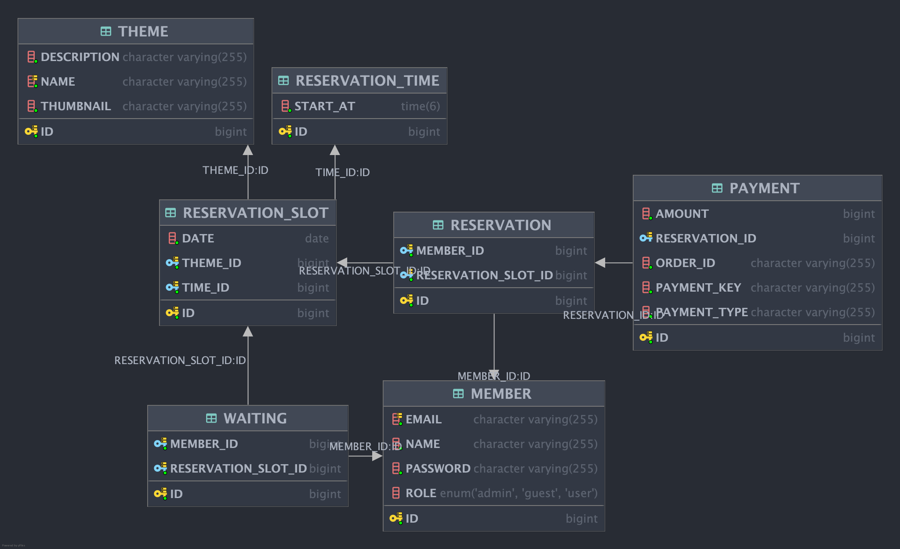

# 방탈출 예약 시스템

## 기능

## 💾 ERD

## 📌 API 목록

### 📋 [Swagger API 문서](http://13.209.80.122:8080/swagger-ui/index.html)

### 🔐 Auth 관련
| Method | Endpoint         | 설명       |
|--------|------------------|------------|
| POST   | /auth/login      | 로그인     |
| POST   | /auth/logout     | 로그아웃   |
| GET    | /auth/check      | 로그인 상태 확인 |

### 👤 Member 관련
| Method | Endpoint         | 설명         |
|--------|------------------|--------------|
| POST   | /members         | 회원 가입    |
| GET    | /members         | 회원 목록 조회 |
| DELETE | /members/{id}    | 회원 삭제    |

### 📅 Reservation 관련
| Method | Endpoint               | 설명               |
|--------|------------------------|--------------------|
| POST   | /reservations          | 예약 생성          |
| GET    | /reservations          | 전체 예약 조회     |
| GET    | /reservations/mine     | 내 예약 조회       |
| DELETE | /reservations/{id}     | 예약 삭제          |
| GET    | /reservations/filtered | 필터된 예약 조회   |

### 🛠 Admin Reservation
| Method | Endpoint               | 설명            |
|--------|------------------------|-----------------|
| POST   | /admin/reservations    | 관리자 예약 생성 |

### ⏰ ReservationTime 관련
| Method | Endpoint               | 설명                   |
|--------|------------------------|------------------------|
| POST   | /times                 | 예약 시간 추가         |
| GET    | /times                 | 예약 시간 목록 조회    |
| GET    | /times/available-times| 사용 가능한 시간 조회  |
| DELETE | /times/{id}           | 예약 시간 삭제         |

### 🎭 Theme 관련
| Method | Endpoint         | 설명             |
|--------|------------------|------------------|
| POST   | /themes          | 테마 생성        |
| GET    | /themes          | 테마 목록 조회   |
| GET    | /themes/popular  | 인기 테마 조회   |
| DELETE | /themes/{id}     | 테마 삭제        |

### ⏳ Waiting 관련
| Method | Endpoint               | 설명              |
|--------|------------------------|-------------------|
| POST   | /waitings              | 대기 등록         |
| GET    | /waitings              | 대기 목록 조회     |
| POST   | /waitings/accept/{id}  | 대기 수락         |
| DELETE | /waitings/{id}         | 대기 삭제         |

### 🖥 View (프론트엔드 페이지 라우팅)
| Method | Endpoint              | 설명                     |
|--------|-----------------------|--------------------------|
| GET    | /login                | 로그인 페이지            |
| GET    | /reservation          | 예약 페이지              |
| GET    | /reservation-mine     | 내 예약 페이지           |
| GET    | /admin                | 관리자 메인 페이지       |
| GET    | /admin/reservation    | 관리자 예약 관리 페이지  |
| GET    | /admin/time           | 관리자 시간 관리 페이지  |
| GET    | /admin/theme          | 관리자 테마 관리 페이지  |
| GET    | /admin/waiting        | 관리자 대기 관리 페이지  |
