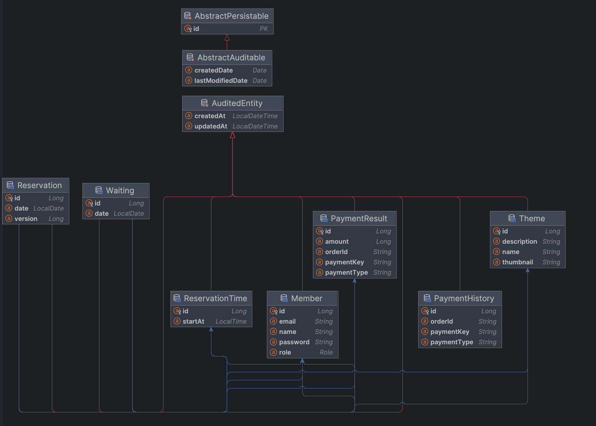

### 인증

- [x] (모든 사용자) 로그인할 수 있다
- [x] (회원) 로그인을 체크할 수 있다
- [x] (회원) 로그아웃할 수 있다

### 회원

- [x] (관리자) 모든 회원의 프로필을 조회할 수 있다.

### 예약

- [x] (관리자) 모든 예약을 조회할 수 있다.
- [x] (관리자) 필터를 통해 모든 예약을 조회할 수 있다.
- [x] (회원) 자신의 모든 에약상태를 조회할 수 있다.
- [x] (회원) 자신의 예약을 추가할 수 있다.
- [x] (관리자) 다른 회원의 예약을 추가할 수 있다.
- [x] (관리자) 예약을 삭제할 수 있다.

### 예약 시간

- [x] (모든 사용자) 모든 에약 시간들을 조회할 수 있다.
- [x] (모든 사용자) 예약 여부와 함께 모든 예약 시간들을 조회할 수 있다.
- [x] (관리자) 새로운 예약 시간을 추가할 수 있다.
- [x] (관리자) 예약 시간을 삭제할 수 있다.

### 테마

- [x] (모든 사용자) 모든 테마를 조회할 수 있다.
- [x] (모든 사용자) 인기 테마를 조회할 수 있다.
- [x] (관리자) 테마를 추가할 수 있다.
- [x] (관리자) 테마를 삭제할 수 있다.

### 예약 대기

- [x] 모든 에약 대기를 조회할 수 있다.
- [x] 예약 대기를 추가할 수 있다.
- [x] 예약 대기를 삭제할 수 있다.

### 결제

- [x] 예약시에는 결제를 해야한다
- [x] 예약대기시에도 결제를 해야한다
- [x] 결제에 문제가 생기면 유저에게 출력해야한다
- [x] 결제에 문제가 생기면 예약이 되지 않는다
- [] 마이페이지에서 결제 현황을 확인할 수 있습니다

---

### 결제시 발생할 수 있는 예외

- 예외상태, 메시지는 api측에 위임합니다.
  https://docs.tosspayments.com/reference/error-codes
- 서버가 요청시 발생하는 timeout,connection 실패 등은 PaymentException으로 다음과 같이 출력됩니다

> 결제 서버에 연결이 실패하였습니다. 이 현상이 지속되는 경우 어드민에게 문의해주세요.

# 예약 API 문서

## 목차

- [1. 모든 예약 조회](#1-모든-예약-조회)
- [2. 필터를 사용한 예약 검색](#2-필터를-사용한-예약-검색)
- [3. 회원의 모든 예약 상태 조회](#3-회원의-모든-예약-상태-조회)
- [4. 관리자에 의한 예약 추가](#4-관리자에-의한-예약-추가)
- [5. 회원에 의한 예약 추가](#5-회원에-의한-예약-추가)
- [6. 예약 삭제](#6-예약-삭제)

---

## 1. 모든 예약 조회

### 요청

```http
GET /reservations
```

### 권한

- `ADMIN` 권한 필요

### 설명

모든 예약 정보를 조회합니다.

### 응답

```json
[
  {
    "id": "Long",
    "memberId": "Long",
    "themeId": "Long",
    "date": "LocalDate",
    "timeId": "Long"
  }
]
```

---

## 2. 필터를 사용한 예약 검색

### 요청

```http
GET /reservations?memberId={memberId}&themeId={themeId}&from={from}&to={to}
```

### 파라미터

| 파라미터     | 타입        | 설명    |
|----------|-----------|-------|
| memberId | Long      | 회원 ID |
| themeId  | Long      | 테마 ID |
| from     | LocalDate | 시작 날짜 |
| to       | LocalDate | 종료 날짜 |

### 권한

- `ADMIN` 권한 필요

### 설명

특정 필터를 사용하여 예약을 검색합니다.

### 응답

```json
[
  {
    "id": "Long",
    "memberId": "Long",
    "themeId": "Long",
    "date": "LocalDate",
    "timeId": "Long"
  }
]
```

---

## 3. 회원의 모든 예약 상태 조회

### 요청

```http
GET /reservations/state
```

### 권한

- `GENERAL` 권한 필요

### 설명

회원의 모든 예약 상태를 조회합니다.

### 응답

```json
{
  "status": "String"
}
```

---

## 4. 관리자에 의한 예약 추가

### 요청

```http
POST /reservations
```

### 권한

- `ADMIN` 권한 필요

### 설명

관리자가 예약을 추가합니다.

### 요청 본문

```json
{
  "memberId": "Long",
  "themeId": "Long",
  "date": "LocalDate",
  "timeId": "Long"
}
```

### 응답

```json
{
  "id": "Long",
  "memberId": "Long",
  "themeId": "Long",
  "date": "LocalDate",
  "timeId": "Long"
}
```

---

## 5. 회원에 의한 예약 추가

### 요청

```http
POST /reservations/mine
```

### 권한

- `GENERAL` 권한 필요

### 설명

회원이 예약을 추가합니다.

### 요청 본문

```json
{
  "themeId": "Long",
  "date": "LocalDate",
  "timeId": "Long",
  "orderId": "String",
  "paymentKey": "String",
  "paymentType": "String",
  "amount": "Integer"
}
```

### 응답

```json
{
  "id": "Long",
  "memberId": "Long",
  "themeId": "Long",
  "date": "LocalDate",
  "timeId": "Long"
}
```

---

## 6. 예약 삭제

### 요청

```http
DELETE /reservations/{reservationId}
```

### 파라미터

| 파라미터          | 타입   | 설명    |
|---------------|------|-------|
| reservationId | Long | 예약 ID |

### 권한

- `ADMIN` 권한 필요

### 설명

특정 예약을 삭제합니다.

### 응답

- 상태 코드: 204 No Content

---

# ERD



# 배포 스크립트 쉘

배포 스크립트쉘은 다음과 같이 작성하였습니다.

```shell
#!/bin/bash

# 배포 스크립트
# 사용법: ./deploy.sh

echo "=== 배포 시작 ==="

# 1. Git Pull
echo "1. Git Pull 진행 중..."
git pull origin praisebak
if [ $? -ne 0 ]; then
echo "❌ Git pull 실패"
exit 1
fi
echo "✅ Git pull 완료"

# 2. Gradle Build
echo "2. Gradle Build 진행 중..."
./gradlew build
if [ $? -ne 0 ]; then
echo "❌ Build 실패"
exit 1
fi
echo "✅ Build 완료"

# 3. 기존 프로세스 종료
echo "3. 기존 프로세스 확인 및 종료..."
PID=$(pgrep -f "java.*jar")
if [ ! -z "$PID" ]; then
echo "기존 프로세스 종료 중... (PID: $PID)"
kill -15 $PID
sleep 5
# 강제 종료가 필요한 경우
if pgrep -f "java.*jar" > /dev/null; then
kill -9 $PID
echo "강제 종료 완료"
fi
fi

# 4. 애플리케이션 실행
echo "4. 애플리케이션 실행 중..."
JAR_FILE=$(find build/libs -name "*.jar" | grep -v plain | head -1)

if [ -z "$JAR_FILE" ]; then
echo "❌ JAR 파일을 찾을 수 없습니다"
exit 1
fi

# nohup으로 백그라운드 실행 및 로그 저장
nohup java -jar $JAR_FILE > server.log 2>&1 &

echo "✅ 애플리케이션 실행 완료"
echo "📝 로그 확인: tail -f server.log"
echo "🔍 프로세스 확인: ps aux | grep java"

echo "=== 배포 완료 ==="
```
