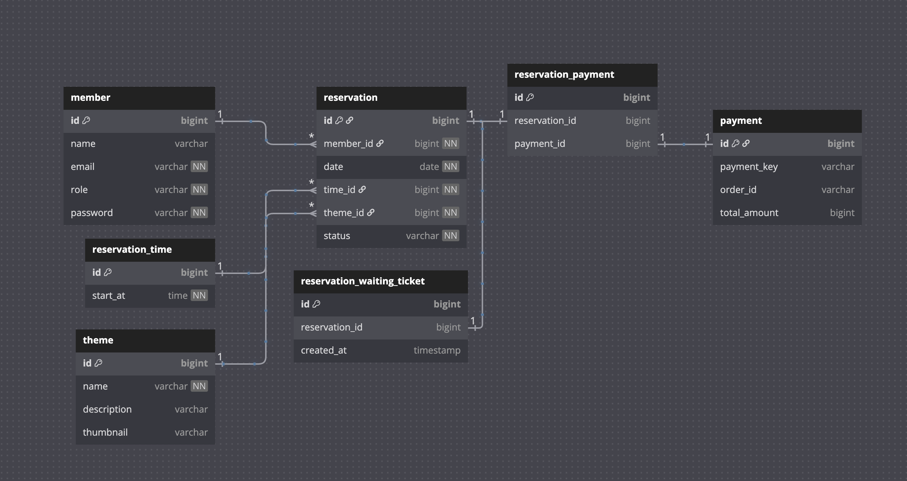

# 방탈출 결제/배포

## 1단계 - 예약 시 결제 단계 추가
- [x] 사용자가 날짜, 테마, 시간을 선택하고 결제를 해서 예약을 할 수 있다.
- [x] 결제 승인 api 호출 실패 시, 사용자에게 안전하게 에러를 핸들링한다.

## 2단계 - 내 예약 페이지 변경
- [x] 내 예약 페이지에서 예약 정보와 결제 정보를 모두 확인할 수 있다.

## 3단계 - 배포하기
- [x] 클라우드 서버에 내 예약 서비스를 배포한다.

## 4단계 - 문서화, 로깅
- [x] 클라이언트 개발자가 이해하기 좋은 형태로 `사용자 예약 페이지`에서 호출하는 모든 API를 확인할 수 있는 API 문서를 작성한다.
- [x] Database ERD를 작성한다.
- [x] 모니터링 및 에러 트래킹을 위해 로깅을 추가한다.

## 사용자 예약 페이지 API 명세
- [API 명세 노션 링크](https://slash-bougon-ea8.notion.site/API-20bb2d6e3e6e8059befaea35d8e1d767?source=copy_link)
- Database ERD
