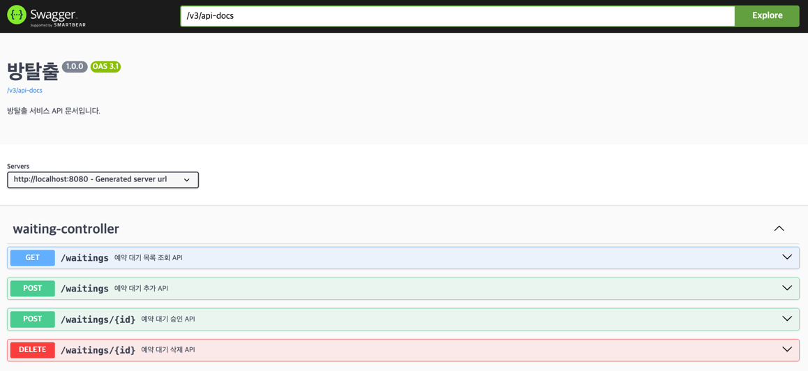
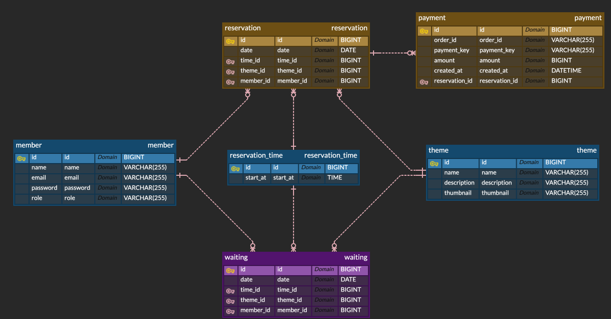

# 방탈출 예약 결제/배포

## 접근 방법

애플리케이션 실행 후 아래의 링크로 접속할 수 있습니다.

- 관리자 페이지: [13.209.11.30:8080/admin](http://13.209.11.30:8080/admin)
    ```plaintext
      테스트 관리자 계정
      email: danny@example.com
      password: 0000
    ```

- 사용자 페이지: [13.209.11.30:8080/](http://13.209.11.30:8080/)
    ```plaintext
  테스트 사용자 계정
  email: sooyang@example.com
  password: 1234
   ```

## API 문서

[API 문서 링크](http://13.209.11.30:8080/swagger-ui/index.html)입니다.



## ERD



## 배포 관련

서버 인스턴스 접근 후 다음의 쉘 스크립트를 실행시켜서 애플리케이션 배포가 가능합니다.

```shell

#!/bin/bash

BRANCH_NAME="step2"
REMOTE_NAME="origin"
PORT_NUMBER=8080
set -e

cd ~/spring-roomescape-payment;
git checkout $BRANCH_NAME;
git pull $REMOTE_NAME $BRANCH_NAME;
echo ${BRANCH_NAME} "최신 파일 업데이트";

./gradlew bootJar;
echo "빌드 완료";

PID=$(lsof -t -i:$PORT_NUMBER)
if [ -n "$PID" ]; then
  echo "PID $PID 에 SIGTERM 시그널 전송"
  kill "$PID"
  for i in {1..10}; do
    if ! kill -0 "$PID" 2>/dev/null; then
      echo "PID $PID 성공적으로 종료"
      break
    fi
    sleep 1
  done
  if kill -0 "$PID" 2>/dev/null; then
    echo "PID $PID 강제 종료 (kill -9) 시도 됨"
    kill -9 "$PID"
  fi
fi

nohup java -jar "$(find build/libs -name "*.jar" | grep -v plain | head -1)" &
echo "애플리케이션 시작됨";

echo "서버와의 SSH 연결 종료됨"
echo "[배포 완료]"

```

---

## 기능 구현 목록

- [x] 화면 수정 - 결제 UI
- [x] 기능 수정
    - [x] 사용자가 결제를 완료해야 예약할 수 있도록 수정
    - [x] 외부 결제 API 연동
        - [x] 사용자에게 결제 실패 사유 제공
    - [x] 내 예약 페이지에 결제 정보 추가 제공
        - [x] 화면 수정 - 내 예약 페이지 UI
        - [x] API 수정 - 결제 정보 추가
