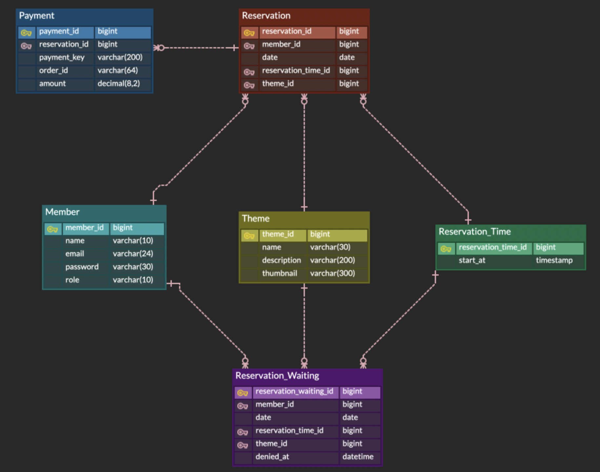

### 방탈출 예약 정책
1. 이미 예약이 존재하는데 예약 요청을 할 경우 예약 대기 상태가 된다.
   - 예약 대기 상태가 된 경우 결제가 되지 않는다.
2. 예약자가 없는데 예약 대기 요청을 할 경우 예약 상태가 된다.
   - 단, 결제가 되지 않아 마이페이지에서 결제를 해야한다.
3. 예약 요청 시 결제에 실패해도 예약가능하다.
   - 단, 결제가 되지 않아 마이페이지에서 결제를 해야한다.
4. 유저는 예약을 취소할 수 없다.
5. 어드민이 예약을 취소하면 예약자는 결제 금액을 환불받고 대기 1번이 예약된다.
   - 단, 결제가 되지 않아 마이페이지에서 결제를 해야한다.

### 4단계 문서화
#### ERD


#### 사용자 예약 페이지 API 문서
[API 문서](https://documenter.getpostman.com/view/28524192/2sA3Qy69if)


### 3단계 배포
배포 URL
http://43.201.59.111:8080

서버 실행 자동화 스크립트
```shell
#!/bin/sh
pidof java spring-roomescape-payment-0.0.1-SNAPSHOT.jar | xargs kill -9
cd spring-roomescape-payment
git pull origin step2
./gradlew bootJar
cd build/libs
nohup java -jar spring-roomescape-payment-0.0.1-SNAPSHOT.jar >> ../../log/spring-roomescape-payment-log.log &
```

### 2단계 구현 기능 목록
- [x] 내 예약 내역 조회에 결제 정보 추가
- [x] 결제시 결제 정보 저장
- [x] 예약 취소시 결제 취소 기능 
- [x] 내 예약 페이지에서 결제 대기인 예약 결제 기능
- [x] 중복 결제 검증
- [x] 어드민 결제 여부 확인

### 1단계 구현 기능 목록
- [x] 예약 생성 전 결제 외부 API 호출
- [x] 예약 실패 시 예외 처리 및 실패 사유 전달
