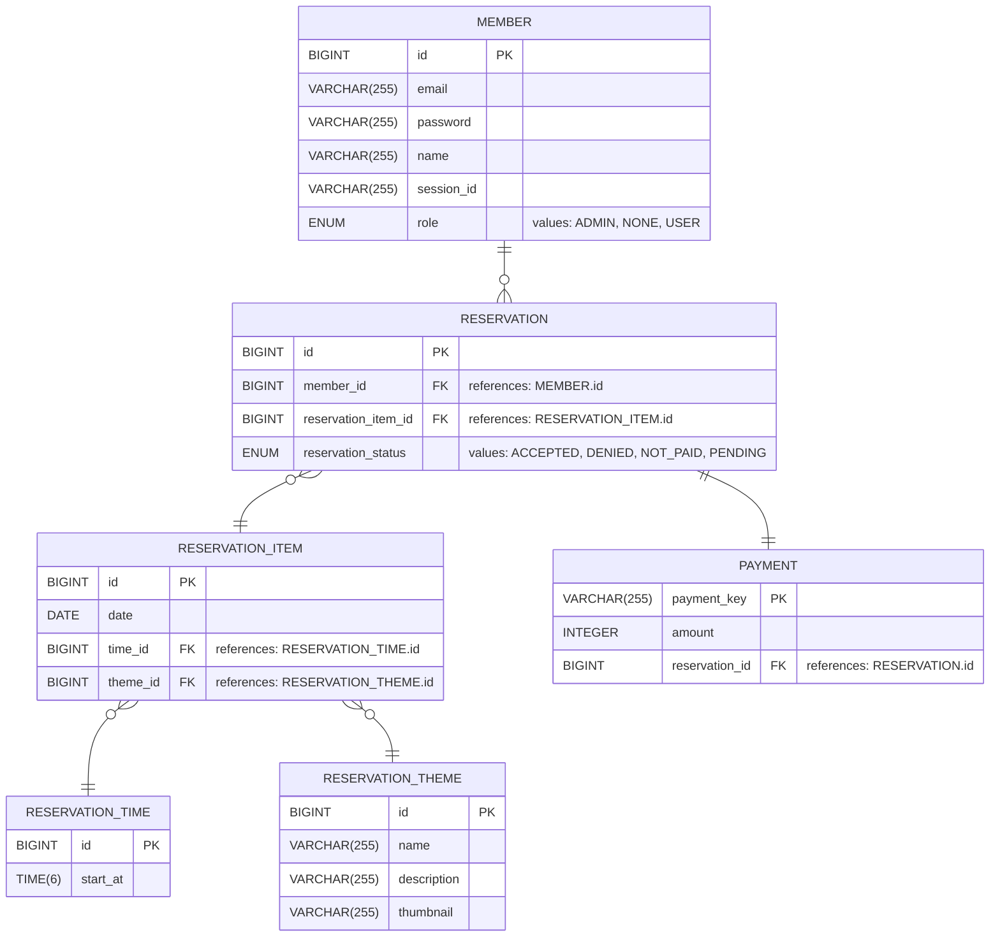

```mermaid
erDiagram
    MEMBER {
        BIGINT id PK
        VARCHAR(255) email
        VARCHAR(255) password
        VARCHAR(255) name
        VARCHAR(255) session_id
        ENUM role "values: ADMIN, NONE, USER"
    }

    RESERVATION {
        BIGINT id PK
        BIGINT member_id FK "references: MEMBER.id"
        BIGINT reservation_item_id FK "references: RESERVATION_ITEM.id"
        ENUM reservation_status "values: ACCEPTED, DENIED, NOT_PAID, PENDING"
    }

    RESERVATION_ITEM {
        BIGINT id PK
        DATE date
        BIGINT time_id FK "references: RESERVATION_TIME.id"
        BIGINT theme_id FK "references: RESERVATION_THEME.id"
    }

    RESERVATION_THEME {
        BIGINT id PK
        VARCHAR(255) name
        VARCHAR(255) description
        VARCHAR(255) thumbnail
    }

    RESERVATION_TIME {
        BIGINT id PK
        TIME(6) start_at
    }

    PAYMENT {
        VARCHAR(255) payment_key PK
        INTEGER amount
        BIGINT reservation_id FK "references: RESERVATION.id"
    }

    MEMBER ||--o{ RESERVATION: ""
    RESERVATION }o--|| RESERVATION_ITEM: ""
    RESERVATION_ITEM }o--|| RESERVATION_TIME: ""
    RESERVATION_ITEM }o--|| RESERVATION_THEME: ""
    RESERVATION ||--|| PAYMENT: ""
```
