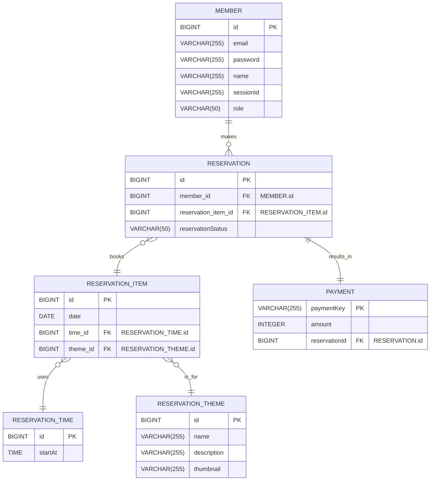

```mermaid
erDiagram
    MEMBER {
        BIGINT id PK
        VARCHAR(255) email
        VARCHAR(255) password
        VARCHAR(255) name
        VARCHAR(255) sessionId
        VARCHAR(50) role
    }

    RESERVATION {
        BIGINT id PK
        BIGINT member_id FK "MEMBER.id"
        BIGINT reservation_item_id FK "RESERVATION_ITEM.id"
        VARCHAR(50) reservationStatus
    }

    RESERVATION_ITEM {
        BIGINT id PK
        DATE date
        BIGINT time_id FK "RESERVATION_TIME.id"
        BIGINT theme_id FK "RESERVATION_THEME.id"
    }

    RESERVATION_THEME {
        BIGINT id PK
        VARCHAR(255) name
        VARCHAR(255) description
        VARCHAR(255) thumbnail
    }

    RESERVATION_TIME {
        BIGINT id PK
        TIME startAt
    }

    PAYMENT {
        VARCHAR(255) paymentKey PK
        INTEGER amount
        BIGINT reservationId FK "RESERVATION.id"
    }

    MEMBER ||--o{ RESERVATION: "makes"
    RESERVATION }o--|| RESERVATION_ITEM: "books"
    RESERVATION_ITEM }o--|| RESERVATION_TIME: "uses"
    RESERVATION_ITEM }o--|| RESERVATION_THEME: "is_for"
    RESERVATION ||--|| PAYMENT: "results_in"
```
