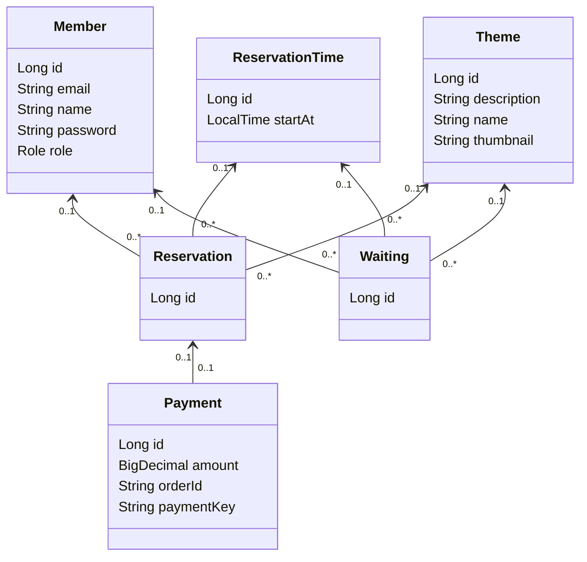

## ERD

```mermaid
classDiagram
direction BT
class Member {
    Long  id
    String  email
    String  name
    String  password
    Role  role
}
class Payment {
    Long  id
    BigDecimal  amount
    String  orderId
    String  paymentKey
}
class Reservation {
    Long  id
}
class ReservationTime {
    Long  id
    LocalTime  startAt
}
class Theme {
    Long  id
    String  description
    String  name
    String  thumbnail
}
class Waiting {
    Long  id
}

Payment "0..1" --> "0..1" Reservation 
Reservation "0..*" --> "0..1" Member 
Reservation "0..*" --> "0..1" ReservationTime 
Reservation "0..*" --> "0..1" Theme 
Waiting "0..*" --> "0..1" Member 
Waiting "0..*" --> "0..1" ReservationTime 
Waiting "0..*" --> "0..1" Theme 

```
