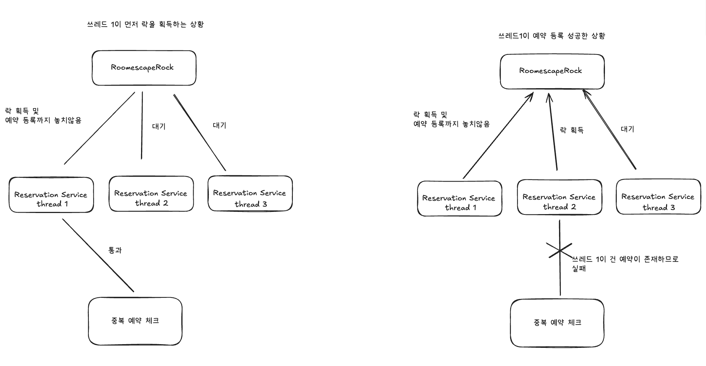

### 결제시 발생할 수 있는 예외

- 예외상태, 메시지는 api측에 위임합니다.
  https://docs.tosspayments.com/reference/error-codes
- 서버가 요청시 발생하는 timeout,connection 실패 등은 PaymentException으로 다음과 같이 출력됩니다

> 결제 서버에 연결이 실패하였습니다. 이 현상이 지속되는 경우 어드민에게 문의해주세요.

### 동시성 문제

예약 시스템에서는 다음과 같이 락을 사용하여 동시성 문제를 해결합니다.

